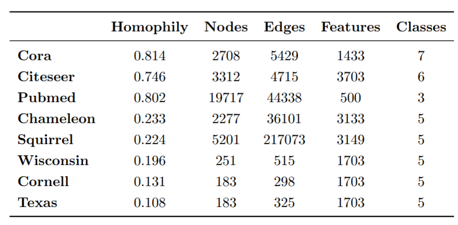

# Beyond Graph Neural Networks: Rethinking Node Classification with Community-Enhanced Machine Learning

Repository containing the code and datasets used in the development of the article Beyond Graph Neural Networks: Rethinking Node Classification with Community-Enhanced Machine Learning.

## Description

This repository gathers the scripts, notebooks, and datasets used for the experiments, analyses, and results presented in the research work.

The main objective is to facilitate the reproducibility of the results and provide supporting material for future research.

## Repository Structure

```text
.
├── images/                 # Images
├── raw_data/               # Original datasets
├── resolution_values/      # Resolutions for each dataset for Leiden algorithm
├── utils/                  # Required intermediate functions
└── README.md
```

## Usage

1. Clone the repository
   
2. Run the code
   
   * 1_Splits
   * 2_Experiment


## Datasets

Known open-access graph datasets in Node Classification tasks

<p align="center">
  
</p>

## Technologies Used

R

## Other comments

#### 1_Splits

* The path for saving all splits is specified after the “Splits path” comment
* The splits path and files could not be created in this repository due to GitHub's specifications.

#### 2_Experiment

* The path for saving CV training results is specified after the “Save CV results on path” comment
* The CV training results path and files could not be created in this repository due to GitHub's specifications.
  
## Author

Eduardo Martinez Tena
